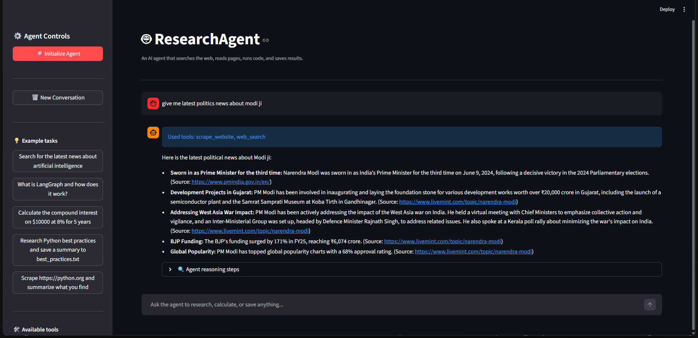
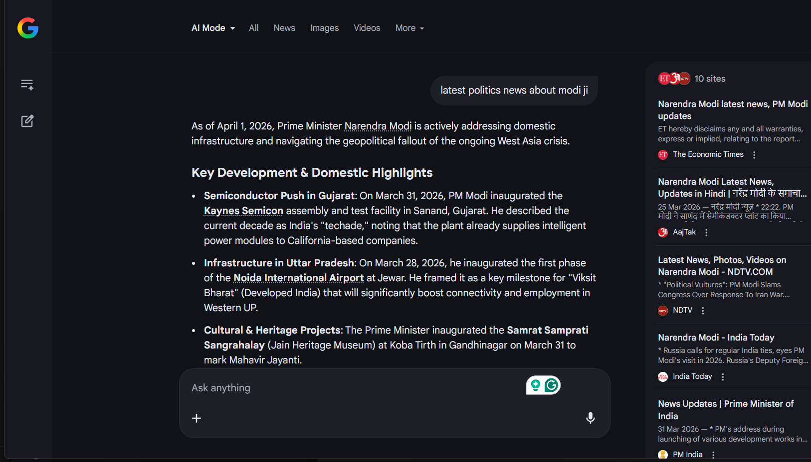
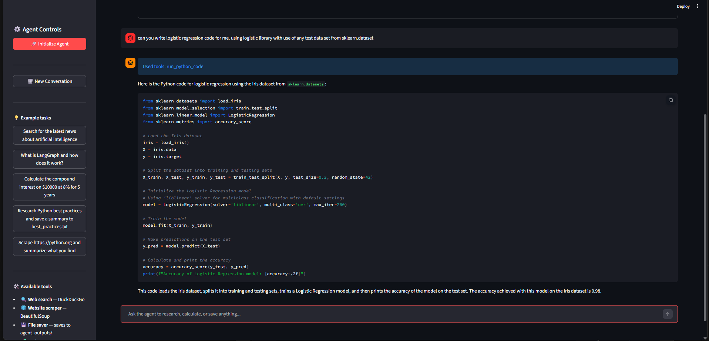

# 🤖 ResearchAgent

An autonomous AI agent that can search the web, scrape websites, run Python
code, and save results to files — all from a single chat interface.
Built with LangGraph, Google Gemini, and Streamlit.

---

## Demo 




---

## What makes this an "agent"?

Unlike a regular chatbot that just answers questions, ResearchAgent
**takes actions** to complete tasks:
```
You:    "Research latest AI news and save a summary to a file"

Agent:  1. Thinks → "I need to search the web"
        2. Uses web_search → finds articles
        3. Thinks → "I should read the top results"
        4. Uses scrape_website → reads full articles
        5. Thinks → "Now summarize and save"
        6. Uses save_to_file → saves report
        7. Reports → "Done! Saved to agent_outputs/ai_news.txt"
```

It reasons → acts → observes → reasons again in a loop until
the task is complete.

---

## Features

- 🔍 **Web search** — searches DuckDuckGo for current information
- 🌐 **Website scraper** — reads full content of any webpage
- 💾 **File saver** — saves reports and results to local files
- 🐍 **Python REPL** — runs calculations and data processing code
- 🧠 **Memory** — remembers context across the entire conversation
- 👣 **Reasoning trace** — shows every step the agent took
- 💬 **Chat interface** — natural language task input via Streamlit

---

## Project Structure
```
research-agent/
├── app.py                  # Streamlit chat UI
├── agent.py                # LangGraph ReAct agent + streaming
├── tools.py                # All 4 agent tools
├── config.py               # Model settings and constants
├── requirements.txt        # Dependencies
├── .env                    # Gemini API key (never committed)
├── .gitignore
├── agent_outputs/          # Files saved by the agent
├── assets/
│   └── demo.png            # App screenshot
└── README.md
```

---

## Setup

### 1. Clone the repository
```bash
git clone https://github.com/rajput-7351/research-agent.git
cd research-agent
```

### 2. Create and activate virtual environment
```bash
python -m venv venv

# Windows
venv\Scripts\activate

# Mac/Linux
source venv/bin/activate
```

### 3. Install dependencies
```bash
pip install -r requirements.txt
```

### 4. Get a free Gemini API key
- Go to [aistudio.google.com](https://aistudio.google.com)
- Sign in with Google
- Click **Get API Key** and copy it

### 5. Add your API key
Create a `.env` file in the root folder:
```
GEMINI_API_KEY=your_actual_key_here
```

### 6. Run the app
```bash
streamlit run app.py
```

---

## How It Works
```
User message
     ↓
LangGraph ReAct loop
     ↓
Gemini thinks → picks a tool
     ↓
Tool executes → returns result
     ↓
Gemini reads result → thinks again
     ↓
Repeat until task complete
     ↓
Final answer streamed to UI
```

### ReAct pattern
ResearchAgent uses the **ReAct** (Reason + Act) pattern:
- **Reason** — the LLM thinks about what to do next
- **Act** — it calls a tool with specific inputs
- **Observe** — it reads the tool output
- **Repeat** — until the task is fully complete

---

## Available Tools

| Tool | Description | Example use |
|------|-------------|-------------|
| `web_search` | Search DuckDuckGo | "Find latest news about X" |
| `scrape_website` | Read any webpage | "Read this article: URL" |
| `save_to_file` | Save to agent_outputs/ | "Save this report as report.txt" |
| `run_python_code` | Execute Python safely | "Calculate compound interest" |

---

## Example Tasks
```
# Research tasks
"What is the latest news about artificial intelligence?"
"Research LangGraph and summarize how it works"
"Find the top 5 Python web frameworks and compare them"

# Save tasks
"Research climate change news and save a report to climate.txt"
"Find Python best practices and save them to best_practices.md"

# Code tasks
"Calculate compound interest on $10000 at 8% for 10 years"
"Write and run code to generate the first 20 Fibonacci numbers"
"Calculate the mean and standard deviation of [23, 45, 12, 67, 34]"

# Combined tasks
"Search for Narendra Modi latest news, scrape the top article,
 and save a summary to modi_news.txt"
```

---

## Tech Stack

| Tool | Purpose |
|------|---------|
| [LangGraph](https://langchain-ai.github.io/langgraph/) | Agent framework and memory |
| [Google Gemini 2.5 Flash](https://aistudio.google.com) | LLM brain (free tier) |
| [LangChain](https://langchain.com) | Tool definitions and LLM interface |
| [DuckDuckGo Search](https://pypi.org/project/duckduckgo-search/) | Free web search |
| [BeautifulSoup4](https://pypi.org/project/beautifulsoup4/) | Web scraping |
| [Streamlit](https://streamlit.io) | Chat web interface |

---

## Safety

The Python code execution tool blocks dangerous operations:
- No file system access (`os`, `shutil`)
- No subprocess execution
- No arbitrary imports
- No `eval` or `exec` of external code

---

## Known Limitations

- Web scraping may fail on JavaScript-heavy sites
- DuckDuckGo search may rate-limit on very frequent requests
- Python REPL is sandboxed — no external library imports allowed
- Requires internet connection for search and scraping

---

## Future Plans

- [ ] Add memory across sessions (persistent storage)
- [ ] Add image analysis tool (multimodal)
- [ ] Deploy to Streamlit Cloud
- [ ] Add more tools: Wikipedia, weather, calculator
- [ ] Support for multi-agent workflows

---

## License

MIT License — free to use and modify.